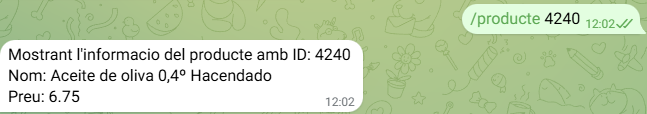
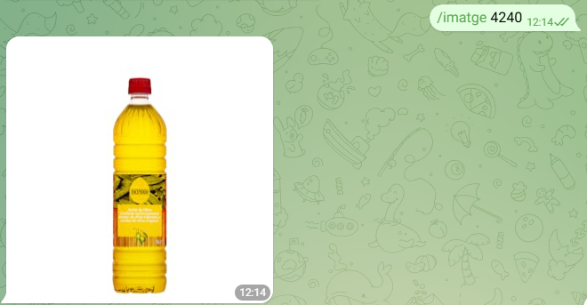

# Explicacio practica telegram
1. Funcio **/start** 

    Aquesta funcio el que fa es iniciar l'aplicacio amb un missatge de benvinguda i la sugerencia de la comanda /help

    

2. Funcio **/help**

    Aquesta funcio el que fa es retornar el llistat de comandes disonibles amb una petita explicacio del que fa cada una

    

3. Funcio **/producte**

    La funcio productes agafa el id que li has proporcionat i mostrar les dades per pantalla, si no existeix el producte envia un missatge sugerint la funcio /mostrarTenda

    

4. Funcio **/imatge**

    La funcio missatge s'utilitza de manera semblant a la funcio /producte, has de posar la funcio amb un id i l'aplicacio retornara l'imatge del producte, he hagut d'afegir el link de la imatge a la base de dades

    

5. Funcio **/afegirproducte**

    Aquesta funcio agafa el id i el numero de productes indicats, els afegeix al carrito de la compra i et mostra un petit resum

    
    
6. Funcio **/mostrarCarrito**

    Aquesta funcio agafa tot el que s'ha afegit al carrito i et mostra un resum de cada producte amb el preu final de cada un i al final de tot et mostra el preu final de tots els productes junts

    

7. Funcio **/acabarCompra**

    Aquesta funcio es una de les extra i el que fa es treure totes les dades del carrito i et mostra un petit missatge

    

8. Funcio **/mostrarTenda**

    Aquesta funcio mostra per pantalla tots els productes que hi ha a la tenda, el seu id i la seva imatge tambe

    

    
